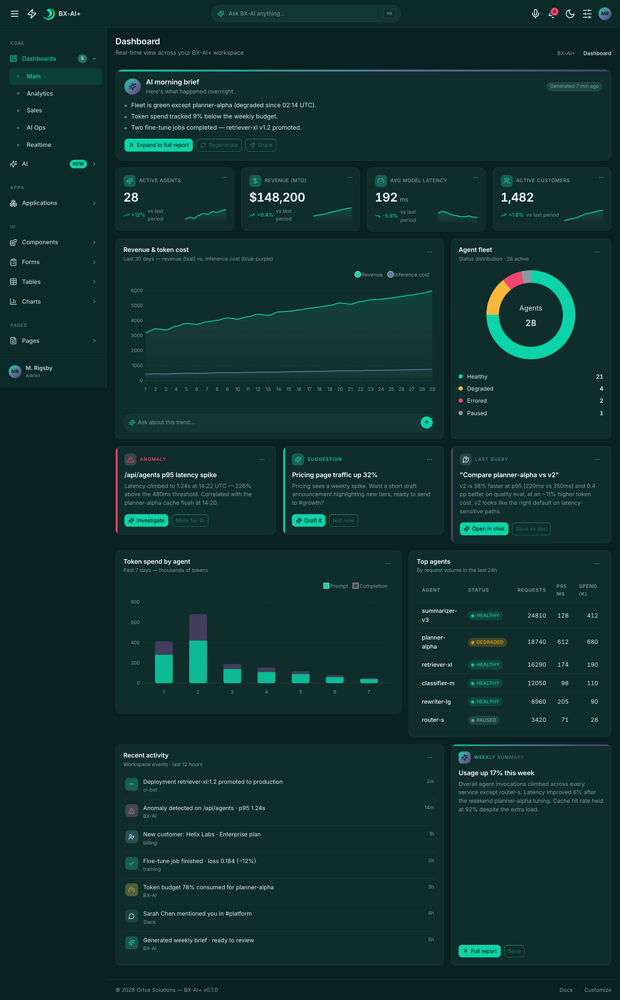
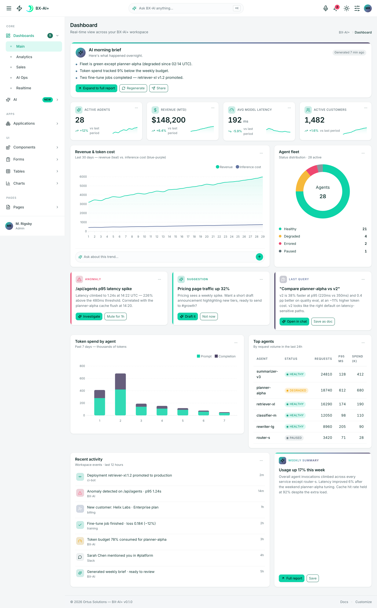

# BX-AI+: AI-centric Bootstrap 5 dashboard theme for BoxLang

An AI-first admin dashboard. **70+ pages** of Bootstrap 5, dark-first with a
light pivot, wired up with a command-palette chat bar, a voice toast, contextual
"Ask AI" affordances on every widget, and live-updating visualizations.
Designed as the UI for the **BoxLang AI+ ColdBox 8.1+ module**, but shipped as
a plain static site so you can run it, screenshot it, and skin it without
touching a backend.

## Hero

| Dark | Light |
|---|---|
|  |  |

*Default dashboard: dark theme (left), light theme (right). Every page ships
both variants; toggle via the topbar theme switch.*

## What it is

- **AI chat bar**: topbar pill or <kbd>⌘K</kbd> anywhere opens a command-
  palette modal; submissions stream into a right-offcanvas AI chat panel with
  mock replies.
- **Voice toast**: microphone button triggers a bottom-right recording toast
  with animated waveform, processing spinner, and transcript review. State-
  machine driven (idle → listening → processing → result → error).
- **AI insight cards**: four variants (anomaly / suggestion / query / summary)
  across dashboards, each with a contextual "Ask AI" button that passes the
  widget's context into the chat panel.
- **Live-updating widgets**: stat cards "breathe" every few seconds via
  seeded drift; a realtime dashboard streams a rolling 60-second chart.
- **Two layouts**: vertical sidebar (default, ~54 pages) and horizontal nav
  strip (parallel page set under `/horizontal/`, 12 mirrors). A customizer
  offcanvas swaps theme / size / color variants with storage persistence.

Full feature tour in
[documentation/HANDOFF-README.md](documentation/HANDOFF-README.md).

## What it isn't

- **No backend.** Every form submits nowhere. Every API call is mocked.
- **No real AI.** Replies come from `src/js/ai/mock-ai.js` regex-matched to
  buckets.
- **No real voice transcription.** The waveform is a seeded-RNG animation; the
  transcript is a canned string.
- **No authentication, database, realtime socket, or telemetry.** Chart data
  is hand-seeded JSON in `src/html/_data/`.

The port job is wrapping this static UI in a ColdBox 8.1+ module and replacing
the mocks with real handlers and models on BoxLang. See
[documentation/BOXLANG-PORT-NOTES.md](documentation/BOXLANG-PORT-NOTES.md).

## Quick start

Two ways in. The zero-dependency option, for poking around:

```bash
unzip bx-ai-plus-theme-dist.zip
cd dist
python3 -m http.server 8080   # or any static server
open http://localhost:8080
```

Or from source (requires **Node ≥ 20**: `.nvmrc` pins the major version):

```bash
npm install
npm run dev      # live-reload dev server at :3000
npm run build    # production build → dist/
```

## More screenshots

<details>
<summary>Open gallery: 20 pages, dark &amp; light</summary>

| Page | Dark | Light |
|---|---|---|
| Dashboard | [view](screenshots/00-dashboard--dark.png) | [view](screenshots/00-dashboard--light.png) |
| Analytics | [view](screenshots/01-dashboard-analytics--dark.png) | [view](screenshots/01-dashboard-analytics--light.png) |
| Sales | [view](screenshots/02-dashboard-sales--dark.png) | [view](screenshots/02-dashboard-sales--light.png) |
| AI-Ops | [view](screenshots/03-dashboard-ai-ops--dark.png) | [view](screenshots/03-dashboard-ai-ops--light.png) |
| Realtime | [view](screenshots/04-dashboard-realtime--dark.png) | [view](screenshots/04-dashboard-realtime--light.png) |
| AI Chat | [view](screenshots/05-ai-chat--dark.png) | [view](screenshots/05-ai-chat--light.png) |
| AI Agents | [view](screenshots/06-ai-agents--dark.png) | [view](screenshots/06-ai-agents--light.png) |
| AI Insights | [view](screenshots/07-ai-insights--dark.png) | [view](screenshots/07-ai-insights--light.png) |
| Calendar | [view](screenshots/08-apps-calendar--dark.png) | [view](screenshots/08-apps-calendar--light.png) |
| Kanban | [view](screenshots/09-apps-kanban--dark.png) | [view](screenshots/09-apps-kanban--light.png) |
| Email | [view](screenshots/10-apps-email--dark.png) | [view](screenshots/10-apps-email--light.png) |
| Chat | [view](screenshots/11-apps-chat--dark.png) | [view](screenshots/11-apps-chat--light.png) |
| Projects | [view](screenshots/12-apps-projects--dark.png) | [view](screenshots/12-apps-projects--light.png) |
| Widgets | [view](screenshots/13-ui-widgets-gallery--dark.png) | [view](screenshots/13-ui-widgets-gallery--light.png) |
| Cards | [view](screenshots/15-ui-cards--dark.png) | [view](screenshots/15-ui-cards--light.png) |
| Forms | [view](screenshots/16-forms-advanced--dark.png) | [view](screenshots/16-forms-advanced--light.png) |
| Wizard | [view](screenshots/17-forms-wizard--dark.png) | [view](screenshots/17-forms-wizard--light.png) |
| DataTables | [view](screenshots/18-tables-datatables--dark.png) | [view](screenshots/18-tables-datatables--light.png) |
| GridJS | [view](screenshots/19-tables-gridjs--dark.png) | [view](screenshots/19-tables-gridjs--light.png) |

Full 61-shot index lives in [screenshots/](screenshots/). Regenerate with
`npm run tour`.

</details>

## Repository layout

```text
src/
├── html/         Eleventy input: pages, layouts, partials, _data
├── scss/         SCSS sources: config, components, structure, ai, pages, plugins, utilities
├── js/           JS modules: core, ai, components, pages, util
├── vendor/       Bundled third-party entries (e.g. Prism custom build)
├── assets/       Images, fonts, brand marks (mirrored 1:1 to dist/assets)
└── static/       Top-level static files (favicons, robots.txt)

tools/            Build scripts (clean, css, js, asset copy, screenshot tour, zip)
documentation/    Handoff, architecture, and porting notes
screenshots/      Output of `npm run tour`: 61 captures, dark + light
dist/             Build output (gitignored)
```

## Scripts

| Script | Purpose |
|---|---|
| `npm run clean` | Wipe `dist/` |
| `npm run build` | Full production build (HTML + CSS + JS + assets) |
| `npm run build:html` | Eleventy only |
| `npm run build:css` | Sass + PostCSS only |
| `npm run build:js` | esbuild only |
| `npm run dev` | Watch + serve with live reload at `:3000` |
| `npm run tour` | Capture the 61-screenshot tour via Playwright |
| `npm run zip` | Build the handoff archive (`bx-ai-plus-theme-dist.zip`) |
| `npm run handoff` | `build` + `tour` + `zip` in sequence |

## Theme architecture

Four conventions load-bear the whole theme. Keep them in mind when extending
it:

- **CSS custom properties (`--bx-*`) drive the theme.** Every visual value
  lives in tokens defined in `src/scss/config/_variables-custom.scss`.
  Changing the palette is a one-file edit.
- **HTML data-attributes drive layout state.** `data-bs-theme`, `data-layout`,
  `data-sidenav-size`, `data-sidenav-color`, `data-topbar-color`,
  `data-layout-width` live on `<html>` and persist to `localStorage` /
  `sessionStorage`. A single controller in `src/js/core/layout.js` reads,
  writes, and dispatches `bx:layoutchange` so charts restyle on theme flip.
- **Seam markers preserve port targets.** Every shared region is wrapped in
  `<!-- BEGIN :: NAME --> … <!-- END :: NAME -->` comments emitted by the
  `seamBegin` / `seamEnd` Eleventy shortcodes. A ColdBox port can grep for
  these and replace each block with a single `#view()#` call.
- **Menu and data shapes are pre-locked.** Page data lives as JSON in
  `src/html/_data/`; each file corresponds to a ColdBox model method whose
  return struct matches the documented shape.

Full architecture notes in
[documentation/ARCHITECTURE.md](documentation/ARCHITECTURE.md).

## Porting to BoxLang / ColdBox

The theme is designed to fold into a **ColdBox 8.1+ module** running on a
BoxLang server. Each partial becomes a `.cfm` view rendered via the `view()`
helper; each `_data/*.json` file becomes a model method whose return struct
lands on the `prc` scope under the same top-level keys. The seam inventory,
data shapes, and mock-to-real swap table are fully documented in
[documentation/BOXLANG-PORT-NOTES.md](documentation/BOXLANG-PORT-NOTES.md).

## Documentation

| Doc | What's inside |
|---|---|
| [documentation/HANDOFF-README.md](documentation/HANDOFF-README.md) | Full handoff: features, conventions, gotchas, ship checklist |
| [documentation/ARCHITECTURE.md](documentation/ARCHITECTURE.md) | Toolchain, SCSS layering, data-attribute controller, library roster |
| [documentation/BOXLANG-PORT-NOTES.md](documentation/BOXLANG-PORT-NOTES.md) | Seam inventory, data shapes, mock→real swap, ColdBox module layout |
| `/documentation/` in the built site | Live, browsable in-app developer reference |

## Conventions

- Developer-facing notes belong in [documentation/](documentation/).
- No jQuery: every library in the roster is vanilla JS.
- No hard-coded colors: use `--bx-*` tokens (see
  `src/scss/config/_variables-custom.scss`).
